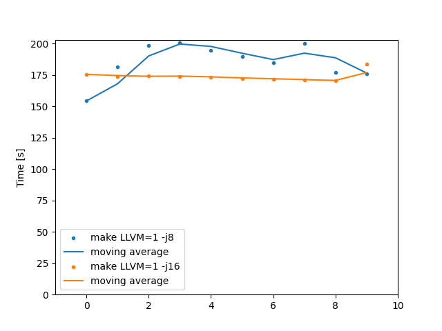

# Linux kernel Benchmarks

This project provides benchmarks for building the Linux kernel using
[hyperfine](https://github.com/sharkdp/hyperfine) and includes archived
results per machine.


## Example Usage

The following example demonstrates building the Linux kernel 10 times
using the `btiny_defconfig` configuration, with both 8 and 16 threads:

```sh
hyperfine \
  --parameter-scan nproc 8 16 \
  --parameter-step-size 8 \
  --prepare 'make LLVM=1 btiny_defconfig' \
  --runs 10 'make LLVM=1 -j{nproc}' \
  --conclude 'make LLVM=1 mrproper' \
  --export-markdown btiny.md \
  --export-json btiny.json
```

Plot using hyperfine [scripts](https://github.com/sharkdp/hyperfine/tree/master/scripts):

* `scripts/advanced_statistics.py`:

```plaintext
./scripts/advanced_statistics.py btiny.json
Command 'make LLVM=1 -j8'
  runs:         10
  mean:    185.788 s
  stddev:   14.436 s
  median:  187.268 s
  min:     154.273 s
  max:     200.768 s

  percentiles:
     P_05 .. P_95:    163.997 s .. 200.506 s
     P_25 .. P_75:    178.339 s .. 197.625 s  (IQR = 19.286 s)

Command 'make LLVM=1 -j16'
  runs:         10
  mean:    173.909 s
  stddev:    3.693 s
  median:  173.312 s
  min:     170.483 s
  max:     183.427 s

  percentiles:
     P_05 .. P_95:    170.647 s .. 179.862 s
     P_25 .. P_75:    171.859 s .. 174.201 s  (IQR = 2.342 s)
```

* `scripts/plot_progression.py`:

```sh
./scripts/plot_progression.py btiny.json --output progression.png
```


