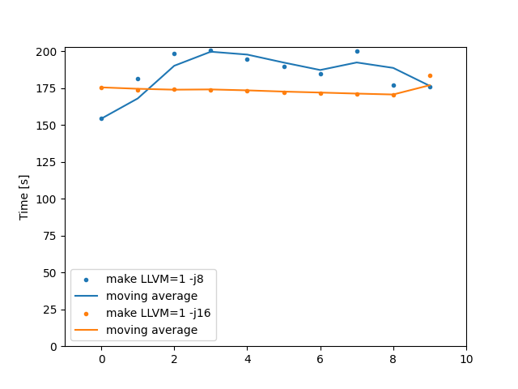

# Linux kernel Benchmarks

This project provides benchmarks for building the Linux kernel using
[hyperfine](https://github.com/sharkdp/hyperfine) and includes archived
results per machine.

## Prerequisites

You need to install the following tools:

### macOS (using Homebrew)

```bash
# Install required tools
brew install hyperfine uv fastfetch

# For macOS development with bee-init (for LLVM toolchain)
# Follow bee-init installation instructions for your setup
```

### Debian/Ubuntu

```bash
# Install hyperfine
curl -LsSf https://github.com/sharkdp/hyperfine/releases/latest/download/hyperfine-aarch64-unknown-linux-gnu.tar.gz | tar xzf - --strip-components=1 -C ~/.local/bin hyperfine-*/hyperfine

# Install uv (Python package manager)
curl -LsSf https://astral.sh/uv/install.sh | sh

# Install fastfetch
sudo apt update
sudo apt install fastfetch  # if available in your repos
# Or download from: https://github.com/fastfetch-cli/fastfetch

# Alternatively, use package manager if available
sudo apt install hyperfine  # if available in your repos
pip install uv             # alternative uv installation
```

## Quick Start

The parametrized Makefile provides various kernel configurations:

```bash
# Run minimal configuration benchmark
make minimal

# Run with custom parameters
make minimal RUNS=5 KERNEL_VERSION=v6.16.0

# Run defconfig benchmark
make defconfig

# Run eBPF-ready configuration
make ebpf-ready

# Generate analysis from results
make analyze plot
```


## Configuration Options

The Makefile provides several predefined configurations:

### Fragment-based Configurations
- `minimal` - Basic functional kernel (KVM + systemd + storage)
- `ebpf-ready` - Minimal + eBPF support with error injection
- `modules-ready` - Minimal + loadable module support  
- `debug-ready` - Minimal + VM debugging and GDB support

### Kernel-native Configurations
- `defconfig` - Architecture default configuration
- `alldefconfig` - All symbols set to default values

### Individual Components
- `kvm_guest`, `virtio-fs`, `systemd`, `distro`, `storage`, `numa`, `ebpf`

## Manual hyperfine Usage

You can also run hyperfine directly with custom configurations:

```sh
# Source environment (macOS only)
source bee-init

# Run hyperfine with custom config
hyperfine \
  --parameter-scan nproc $(nproc) $(($(nproc) * 2)) \
  --parameter-step-size $(nproc) \
  --prepare 'make defconfig' \
  --runs 10 'make -j{nproc}' \
  --conclude 'make mrproper' \
  --export-markdown defconfig.md \
  --export-json defconfig.json
```

Plot using hyperfine [scripts](https://github.com/sharkdp/hyperfine/tree/master/scripts):

* `scripts/advanced_statistics.py`:

```plaintext
./scripts/advanced_statistics.py btiny.json
Command 'make LLVM=1 -j8'
  runs:         10
  mean:    185.788 s
  stddev:   14.436 s
  median:  187.268 s
  min:     154.273 s
  max:     200.768 s

  percentiles:
     P_05 .. P_95:    163.997 s .. 200.506 s
     P_25 .. P_75:    178.339 s .. 197.625 s  (IQR = 19.286 s)

Command 'make LLVM=1 -j16'
  runs:         10
  mean:    173.909 s
  stddev:    3.693 s
  median:  173.312 s
  min:     170.483 s
  max:     183.427 s

  percentiles:
     P_05 .. P_95:    170.647 s .. 179.862 s
     P_25 .. P_75:    171.859 s .. 174.201 s  (IQR = 2.342 s)
```

* `scripts/plot_progression.py`:

```sh
./scripts/plot_progression.py btiny.json --output progression.png
```


