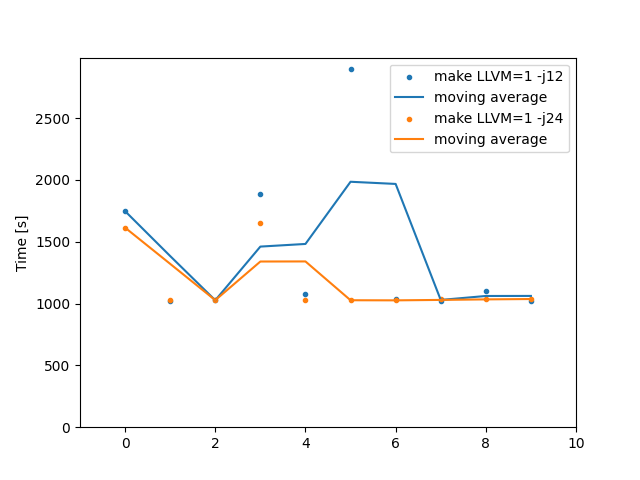
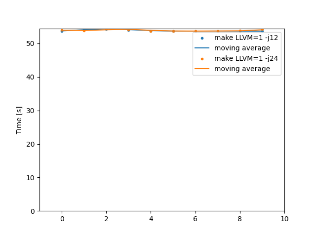

# MAC1611 Benchmark Report

Comprehensive benchmark results for machine **mac1611**.

Generated on: 2025-08-26 09:54:24

## Kernel Version v6.16.0

### LLVM Compiler Results

## Allyesconfig Configuration

### System Information

- **CPU**: Apple M4 Pro (12) @ 4.51 GHz
- **CPU Cache (L1)**: 8x192.00 KiB (I), 8x128.00 KiB (D), 4x128.00 KiB (I), 4x64.00 KiB (D)
- **CPU Cache (L2)**: 2x16.00 MiB (U), 4.00 MiB (U)
- **GPU**: Apple M4 Pro (16) @ 1.58 GHz [Integrated]
- **Kernel**: Darwin 24.4.0
- **OS**: macOS Sequoia 15.4.1 arm64
- **Host**: Mac Mini (2024)
- **Memory**: 6.28 GiB / 24.00 GiB (26%)
- **Physical Memory**: 24.00 GiB - LPDDR5 (Micron)
- **Build Environment**: 
- **Compiler**: LLVM/Clang
- **LLVM Flag**: LLVM=1
- **Make Threads**: 12-24 (step: 12)
- **Benchmark Runs**: 10
- **Warmup Runs**: 1
- **Kernel Source**: /Users/dagomez/src/kernel/linux
- **Config Fragments**: /Users/dagomez/src/linux-config-fragments
- **Machine ID**: mac1611
- **Kernel Version**: v6.16.0
- **Build Date**: 2025-08-25 23:00:13 CEST
- **GCC Version**: Apple clang version 17.0.0 (clang-1700.0.13.3)
- **Clang Version**: Homebrew clang version 20.1.8

### Benchmark Results Summary

| Command | Mean (s) | Std Dev (s) | Min (s) | Max (s) | Runs |
|---------|----------|-------------|---------|---------|------|
| `make -j12` | 1384.529 | 622.536 | 1019.305 | 2896.100 | 10 |
| `make -j24` | 1151.044 | 254.815 | 1026.127 | 1654.026 | 10 |

### Performance Progression



### Advanced Statistics

```
Command 'make LLVM=1 -j12'
  runs:         10
  mean:   1384.529 s
  stddev:  622.536 s
  median: 1057.335 s
  min:    1019.305 s
  max:    2896.100 s

  percentiles:
     P_05 .. P_95:    1019.708 s .. 2443.340 s
     P_25 .. P_75:    1024.085 s .. 1586.740 s  (IQR = 562.655 s)

Command 'make LLVM=1 -j24'
  runs:         10
  mean:   1151.044 s
  stddev:  254.815 s
  median: 1030.839 s
  min:    1026.127 s
  max:    1654.026 s

  percentiles:
     P_05 .. P_95:    1026.155 s .. 1636.117 s
     P_25 .. P_75:    1026.871 s .. 1037.929 s  (IQR = 11.058 s)
```


## Minimal Configuration

### System Information

- **CPU**: Apple M4 Pro (12) @ 4.51 GHz
- **CPU Cache (L1)**: 8x192.00 KiB (I), 8x128.00 KiB (D), 4x128.00 KiB (I), 4x64.00 KiB (D)
- **CPU Cache (L2)**: 2x16.00 MiB (U), 4.00 MiB (U)
- **GPU**: Apple M4 Pro (16) @ 1.58 GHz [Integrated]
- **Kernel**: Darwin 24.4.0
- **OS**: macOS Sequoia 15.4.1 arm64
- **Host**: Mac Mini (2024)
- **Memory**: 7.63 GiB / 24.00 GiB (32%)
- **Physical Memory**: 24.00 GiB - LPDDR5 (Micron)
- **Build Environment**: 
- **Compiler**: LLVM/Clang
- **LLVM Flag**: LLVM=1
- **Make Threads**: 12-24 (step: 12)
- **Benchmark Runs**: 10
- **Warmup Runs**: 1
- **Kernel Source**: /Users/dagomez/src/kernel/linux
- **Config Fragments**: /Users/dagomez/src/linux-config-fragments
- **Machine ID**: mac1611
- **Kernel Version**: v6.16.0
- **Build Date**: 2025-08-26 09:05:02 CEST
- **GCC Version**: Apple clang version 17.0.0 (clang-1700.0.13.3)
- **Clang Version**: Homebrew clang version 20.1.8

### Benchmark Results Summary

| Command | Mean (s) | Std Dev (s) | Min (s) | Max (s) | Runs |
|---------|----------|-------------|---------|---------|------|
| `make -j12` | 53.851 | 0.294 | 53.627 | 54.437 | 10 |
| `make -j24` | 53.921 | 0.259 | 53.683 | 54.366 | 10 |

### Performance Progression



### Advanced Statistics

```
Command 'make LLVM=1 -j12'
  runs:         10
  mean:     53.851 s
  stddev:    0.294 s
  median:   53.728 s
  min:      53.627 s
  max:      54.437 s

  percentiles:
     P_05 .. P_95:    53.640 s .. 54.389 s
     P_25 .. P_75:    53.660 s .. 53.885 s  (IQR = 0.225 s)

Command 'make LLVM=1 -j24'
  runs:         10
  mean:     53.921 s
  stddev:    0.259 s
  median:   53.801 s
  min:      53.683 s
  max:      54.366 s

  percentiles:
     P_05 .. P_95:    53.697 s .. 54.354 s
     P_25 .. P_75:    53.729 s .. 54.056 s  (IQR = 0.328 s)
```

